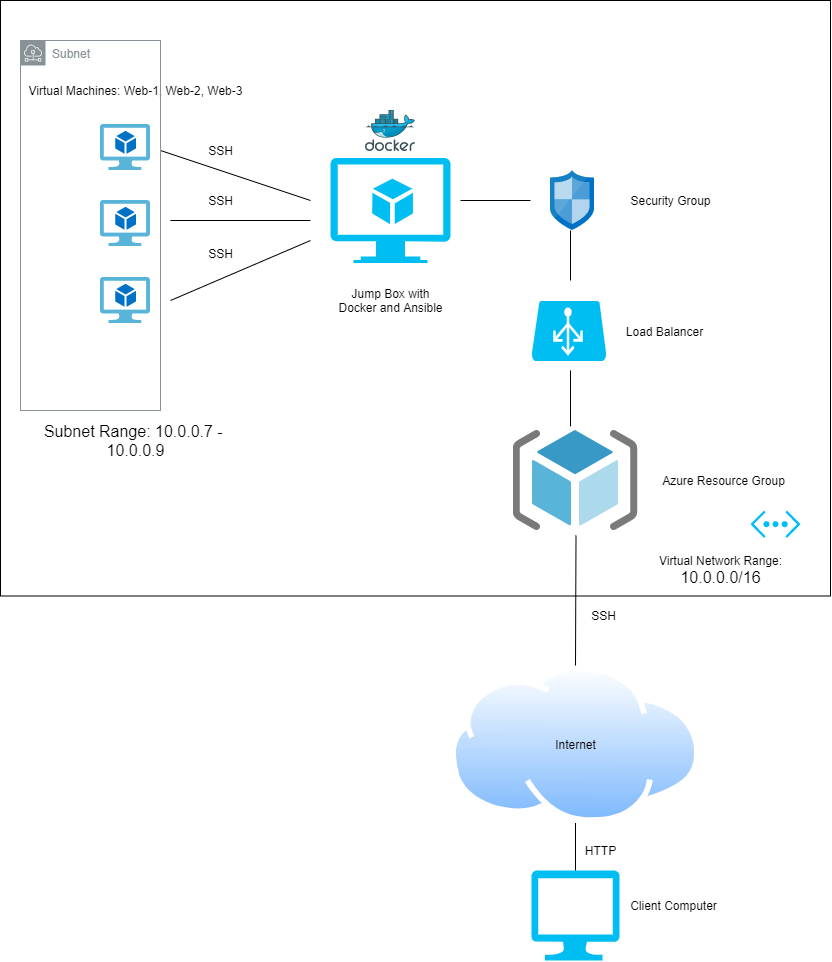

## Automated ELK Stack Deployment

The files in this repository were used to configure the network depicted below.

These files have been tested and used to generate a live ELK deployment on Azure. They can be used to either recreate the entire deployment pictured above. Alternatively, select portions of the _____ file may be used to install only certain pieces of it, such as Filebeat.

The install-elk.yml file can be found in Ansible folder.

This document contains the following details:
- Description of the Topology
- Access Policies
- ELK Configuration
  - Beats in Use
  - Machines Being Monitored
- How to Use the Ansible Build

### Description of the Topology

The main purpose of this network is to expose a load-balanced and monitored instance of DVWA, the D*mn Vulnerable Web Application.

Load balancing ensures that the application will be highly available, in addition to restricting traffic to the network.
- Load balancers protect against DDoS attacks by distributing network traffic across servers. This means that no single server will be overloaded with traffic, increasing the availaility of an application and responsiveness. Jump boxes allow users to access servers by first connecting to a secured and monitored machine. This protects endpoint servers by ensuring that incoming traffic are examined before being entering the server. This works the other way around too; when remotely accessing an exploited device, the originating device could also be compromised. Jump boxes protect against such attacks. 

Integrating an ELK server allows users to easily monitor the vulnerable VMs for changes to the jump box and system network.
- Filebeat monitors modifications and suspicious behaviours of files and Metricbeat gathers statistics regarding the OS and running services, such as CPU usage, memory and file systems.

The configuration details of each machine may be found below.

| Name     | Function | IP Address | Operating System   |
|----------|----------|------------|--------------------|
| Jump Box | Gateway  | 10.0.0.6   | Linux ubuntu 18.04 |
| Web-1    | Webserver| 10.0.0.7   | Linux ubuntu 18.04 |
| Web-2    | Webserver| 10.0.0.8   | Linux ubuntu 18.04 |
| Web-3    | Webserver| 10.0.0.9   | Linux ubuntu 18.04 |
| Elk-VM   | Monitor  | 10.1.0.4   | Linux ubuntu 18.04 |

### Access Policies

The machines on the internal network are not exposed to the public Internet. 

Only the Elk machine can accept connections from the Internet. Access to this machine is only allowed from the following IP addresses:
- 5601
- 9200
- 5044

Machines within the network can only be accessed by the jump box using Ansible.
- Only the Jump box can access ELk, the through my IP 87.121.93.132.

A summary of the access policies in place can be found in the table below.

| Name     | Publicly Accessible | Allowed IP    |
|----------|---------------------|---------------|
| Jump Box | Yes                 | 87.121.93.132 |
| Web-1    | No                  | 10.0.0.6      |
| Web-2    | No                  | 10.0.0.6      |
| Web-3    | No                  | 10.0.0.6      |
| Elk VM   | No                  | 87.121.93.132 |

### Elk Configuration

Ansible was used to automate configuration of the ELK machine. No configuration was performed manually, which is advantageous because...
- Ansible is a free open-source program that allows complex configurations to be set up by simple Ansible Playbooks, which don't require complicated coding syntax. This allows administrators to set up multiple machines without having to do so manually.

The playbook implements the following tasks
- Install Docker
- Install pip3
- Install Docker Python Module
- Download and launch a Docker container
- Enables Docker

The following screenshot displays the result of running `docker ps` after successfully configuring the ELK instance.

### Target Machines & Beats
This ELK server is configured to monitor the following machines:
- 10.0.0.7
- 10.0.0.8
- 10.0.0.9

We have installed the following Beats on these machines:
- Filebeats

These Beats allow us to collect the following information from each machine
- Filebeat collects logs from the file system

### Using the Playbook
In order to use the playbook, you will need to have an Ansible control node already configured. Assuming you have such a control node provisioned: 

SSH into the control node and follow the steps below:
- Copy the _____ file to _____.
- Update the Hosts file to include Webserver and Elk
- Run the playbook, and navigate to http://168.61.211.34:5601/app/kibana to check that the installation worked as expected.

- _Which file is the playbook? Where do you copy it?_ The file is /etc/ansible/files/filebeat-config.yml and it's copied to /etc/filebeat/filebeat.yml
- _Which file do you update to make Ansible run the playbook on a specific machine? How do I specify which machine to install the ELK server on versus which to install Filebeat on?_ Update hosts file
- _Which URL do you navigate to in order to check that the ELK server is running? http://168.61.211.34:5601/app/kibana

